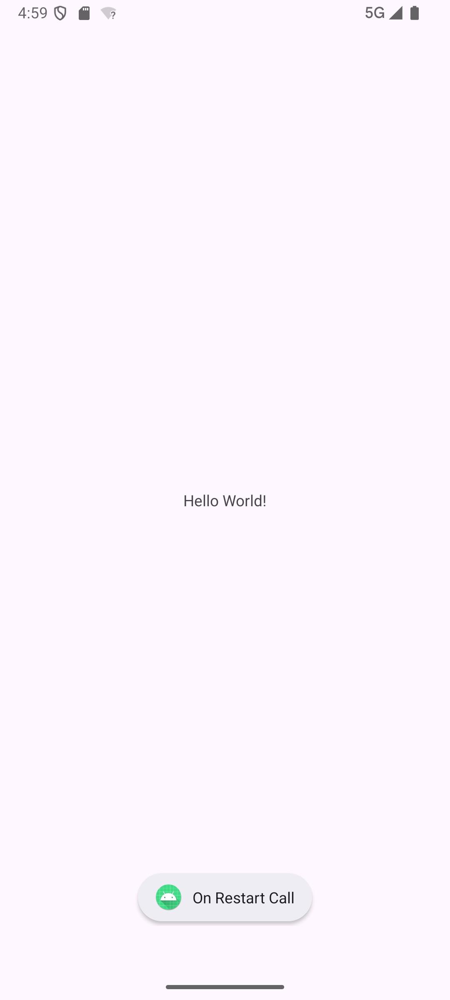

# Android Activity Lifecycle with Toast Messages

This document outlines the different lifecycle methods of an Android Activity and shows examples of Toast messages displayed at each stage.

## Lifecycle Methods and Toasts

The `MainActivity.kt` in this project demonstrates the Android Activity lifecycle by displaying a Toast message and logging a message for each lifecycle callback.

### 1. `onCreate()`

*   **Description:** This is the first callback and is called when the activity is first created. It's where you should perform all basic application startup logic that should happen only once for the entire life of the activity.
*   **Toast Message:** "ON Create Call"
*   **Screenshot:**
    <!-- TODO: Insert screenshot of the "ON Create Call" Toast message here -->
    Example: 

### 2. `onStart()`

*   **Description:** Called when the activity is becoming visible to the user.
*   **Toast Message:** "ON Start Call"
*   **Screenshot:**
    <!-- TODO: Insert screenshot of the "ON Start Call" Toast message here -->
     Example:  

### 3. `onResume()`

*   **Description:** Called when the activity will start interacting with the user. At this point, the activity is at the top of the activity stack, with user input going to it.
*   **Toast Message:** "On Resume Call"
*   **Screenshot:**
    <!-- TODO: Insert screenshot of the "On Resume Call" Toast message here -->
     Example: 

### 4. `onPause()`

*   **Description:** Called when the system is about to start resuming a previous activity. This callback is typically used to release resources, save persistent state, and stop animations or other ongoing actions that may consume CPU.
*   **Toast Message:** "On pause Call"
*   **Screenshot:**
    <!-- TODO: Insert screenshot of the "On pause Call" Toast message here -->
     Example: 

### 5. `onStop()`

*   **Description:** Called when the activity is no longer visible to the user. This may happen because it is being destroyed, or because another activity (either an existing one or a new one) has been resumed and is covering it.
*   **Toast Message:** "on Stop Call"
*   **Screenshot:**
    <!-- TODO: Insert screenshot of the "on Stop Call" Toast message here -->
    <!-- Example:  -->

### 6. `onRestart()`

*   **Description:** Called after your activity has been stopped, prior to it being started again.
*   **Toast Message:** "On Restart Call"
*   **Screenshot:**
    <!-- TODO: Insert screenshot of the "On Restart Call" Toast message here -->
    Example: 

### 7. `onDestroy()`

*   **Description:** Called before the activity is destroyed. This is the final call that the activity receives.
*   **Toast Message:** "On Destroy Call"
*   **Screenshot:**
    <!-- TODO: Insert screenshot of the "On Destroy Call" Toast message here -->
    <!-- Example:  -->

## Code Snippet (`MainActivity.kt`)

